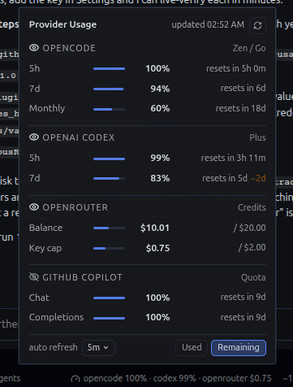
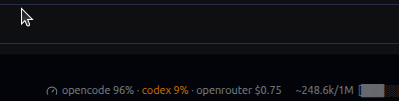
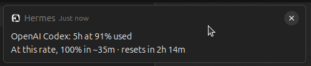

# Provider Usage

Per-provider quota and balance readout in the Hermes desktop status bar:
**OpenCode**, **OpenAI Codex**, **OpenRouter**, plus **Anthropic**,
**GitHub Copilot**, **Nous**, **Z.AI**, **Kimi**, **MiniMax**, and
**DeepSeek** when configured.

Providers appear only when their credentials are usable; unconfigured
providers are omitted from the panel entirely.

## Screenshots







## What it shows

- **Status bar**: the providers you pick with the eye toggles, e.g.
  `opencode 6% · codex 2% · openrouter $0.32` (5h windows for quota providers,
  key-cap figure for OpenRouter; flips with Used/Remaining). Until a toggle
  is touched, only the first provider shows.
- **Popover**: dense rows with every window, reset times, balance and key-cap
  amounts, and a manual refresh button.
- **Near-limit tint**: any window or the OpenRouter key cap at 80%+ used
  renders amber in the bar and in the popover.
- **Native alerts**: one desktop notification per threshold crossing, deduped
  per window cycle (keyed by the reset time) and once a day for the key cap.
- **Burn-rate projections**: `~2d` appears next to a window when it would hit
  100% before its own reset at the currently observed rate; caps show the
  projected exhaustion when inside 14 days.
- **Footer controls**: auto refresh picker (30s / 1m / 5m / 10m) and a
  Used/Remaining toggle. Both persist across app restarts.
- **Provider toggles**: an eye button on each provider header shows or hides
  that provider in the status bar. Persists across app restarts.

## Providers and what it reads

| Provider | Credential (read-only) | Endpoint |
|---|---|---|
| OpenCode Zen | `OPENCODE_CONSOLE_COOKIE` (console session, read-only) | `https://opencode.ai/_server` (balance); falls back to the local ledger |
| OpenCode | `OPENCODE_GO_API_KEY` via the Hermes secret scope, else `~/.local/share/opencode/auth.json` | `https://opencode.ai/zen/go/v1/usage` |
| OpenAI Codex | Hermes' Codex sign-in (account-usage helper), else `~/.codex/auth.json` | `https://chatgpt.com/backend-api/wham/usage` |
| OpenRouter | `OPENROUTER_API_KEY` via the Hermes secret scope | `https://openrouter.ai/api/v1/key`, `https://openrouter.ai/api/v1/credits` |
| Anthropic | Hermes' Claude Code sign-in (account-usage helper), else the Claude Code OAuth token in `~/.claude/.credentials.json` | `https://api.anthropic.com/api/oauth/usage` |
| GitHub Copilot | Hermes' Copilot token resolver | `https://api.github.com/copilot_internal/user` |
| Nous | Hermes' Nous Portal sign-in | Nous Portal account info |
| Z.AI / GLM | `ZAI_API_KEY` or `GLM_API_KEY` | `https://api.z.ai/api/monitor/usage/quota/limit` |
| Kimi | `KIMI_API_KEY` or `MOONSHOT_API_KEY` | `https://api.kimi.com/coding/v1/usages` (falls back to the Moonshot balance: `https://api.moonshot.ai/v1/users/me/balance` first, then `api.moonshot.cn`) |
| MiniMax | `MINIMAX_API_KEY` | `https://api.minimax.io/v1/api/openplatform/coding_plan/remains` |
| DeepSeek | `DEEPSEEK_API_KEY` | `https://api.deepseek.com/user/balance` |

## Zen balance and spend tracking

The OpenCode Zen card shows a live **Balance** when `OPENCODE_CONSOLE_COOKIE`
is set: Zen has no key-authenticated balance API, so the number is scraped
read-only from OpenCode's login-gated console billing RPC
(`GET https://opencode.ai/_server`). To capture the cookie: log into
`https://opencode.ai`, open DevTools → Application → Cookies, copy the value
of the `auth` cookie, and add `OPENCODE_CONSOLE_COOKIE=<value>` to your
Hermes profile's `.env` (`$HERMES_HOME/.env`). The console
workspace id is auto-discovered from the local `opencode.db`; override with
`OPENCODE_WORKSPACE_ID` if you have several.

Two known failure modes degrade silently to the estimated-spend readout instead
of erroring: the session cookie expires (re-paste a fresh one) and OpenCode
rotates the server-function id that backs the billing RPC (symptom: the card
stops reporting a live balance; the request id comes from the `/_server`
request on the console billing page in DevTools → Network).

Without a cookie, spend is estimated from the **local token ledgers** times
public [Models.dev](https://models.dev) pricing, not read from a stored cost
column. Two ledgers are summed (see `_zen_ledger_rows` in
`dashboard/plugin_api.py`), because neither alone sees all Zen traffic:

| Ledger | Records | Path |
| --- | --- | --- |
| Hermes `state.db` | every turn Hermes makes | `$HERMES_HOME/state.db`, table `session_model_usage`, rows with `billing_provider = 'opencode-zen'` |
| OpenCode CLI | sessions run outside Hermes | `~/.local/share/opencode/opencode.db`, table `session`, rows whose `model.providerID` is `opencode` |

The two are disjoint — no shared session ids — so summing them does not
double-count. Cost is `tokens × price_per_1M / 1_000_000` per model, with
zero-rated models (the `-free` tiers) contributing $0. Both are opened
**read-only**; the plugin never writes to either.

**This is cumulative spend, not a remaining balance.** It only rises. A true
balance requires the console cookie above. The window is the current calendar
month, widening to all history when the month has no billable Zen usage yet —
a bare `$0` would hide real spend, which is worse than a wider window.

Hermes' own `session_model_usage.estimated_cost_usd` is deliberately not used:
it has no pricing entry for `opencode-zen` and stores `0` for every such row.

OpenCode Go is a subscription and is intentionally hidden from the spend
readout (its usage windows are shown separately, not as a dollar figure).

## Privacy

- **Read-only credentials.** The plugin writes nothing back to any credential
  file and never mints or refreshes a token itself. No browser cookies beyond
  an explicitly user-supplied read-only console session (OpenCode Zen
  balance); no credential CLIs. Providers marked as resolved by Hermes use the app's own
  account-usage helpers (the same code path as Hermes' `/usage` surfaces,
  including Hermes' normal credential upkeep).
- **No subprocesses.** Every provider call is an in-process `httpx` request;
  nothing is shelled out, and no helper process ever sees a credential.
- **Credentials never enter a URL or an error message.** Keys and the console
  cookie travel only in request headers, never in a query string, so they
  cannot leak through access logs, proxies, or a redirect. Provider response
  bodies are not echoed into errors that reach the panel: `_decode_json_body`
  reports only the status, byte count, and first few characters of a
  non-JSON body, so a provider that reflects a rejected credential back
  cannot surface it in the UI.
- **Read-only local ledgers.** Hermes `state.db` and the OpenCode CLI
  `opencode.db` are opened with `mode=ro`; the plugin never writes to either.
- **Client identity disclosure.** The GitHub Copilot check queries GitHub's
  internal Copilot usage endpoint presenting the VS Code / Copilot client
  identity (`Editor-Version`, `User-Agent`), the same identity the Copilot
  editor plugin presents.
- **All provider calls happen on your machine**, from the plugin's own backend
  half. The only network peers are the provider endpoints listed above.
- **No telemetry, no analytics, no self-updater.**
- The desktop half talks only to your own Hermes backend at
  `/api/plugins/provider-usage/`.

## Install

Once listed, install from the plugin catalog:

```
hermes plugins install provider-usage
```

Until then, install manually:

1. Clone this repository into `$HERMES_HOME/plugins/provider-usage/`
   (`~/.hermes/plugins/provider-usage/` by default).
2. Enable it: `hermes plugins enable provider-usage`.
3. Reload the desktop app. The bar item appears in the right cluster and the
   plugin is listed under Settings, Capabilities, Plugins.

Requires a Hermes build with the desktop plugin SDK (`>=0.21.0`).

## Notes on projections

Projections need at least 30 minutes of observed history inside the last 6
hours. The backend samples history in memory whenever it refreshes; a restart
pauses projections until samples reaccumulate. The payload carries
`eta_seconds` on windows and `depletes_in_seconds` on money rows, and the UI
only surfaces them when they are actionable (window hits 100% before its
reset; cap depletes within 14 days).

## Layout

```
plugin.yaml              Agent manifest
__init__.py              Agent entry point (inert by design)
dashboard/manifest.json  Dashboard manifest (mounts the backend router)
dashboard/plugin_api.py  Backend: fetchers, cache, burn-rate history
desktop/plugin.js        Desktop: status-bar item, popover, alerts
```

## Development

- `hermes plugins validate .` runs the same admission checks as the catalog CI.
- The backend served payload is a single JSON object:
  `{ fetched_at, providers: [{ id, name, tag, status, windows | money }] }`.

## License

MIT
